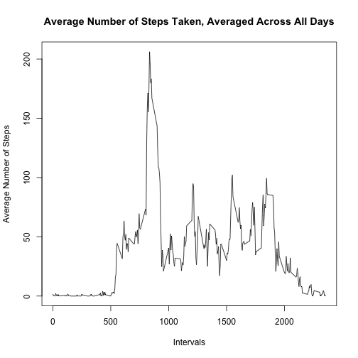
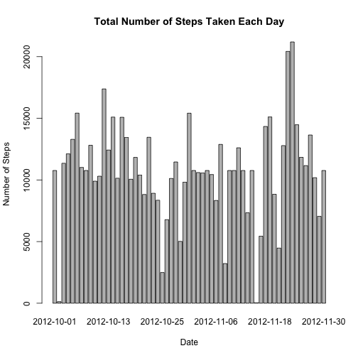

Reproducible Research: Peer Assessment 1
=====
Author: Eric Villegas

Github Link: [https://github.com/evillega/RepData_PeerAssessment1](https://github.com/evillega/RepData_PeerAssessment1)


## Loading and preprocessing the data
1.  Load the data (i.e. `read.csv()`).
2.  Process/transform the data (if necessary) into a format suitable for your analysis.


```r
setwd("~/Desktop/Coursera/DataScience/5-Reproducible Research/5-ProjectAssignment_1/RepData_PeerAssessment1/RepData_PeerAssessment1")

library("knitr")

unzip("activity.zip")

activity <- read.csv("activity.csv")
```


## What is mean total number of steps taken per day?

1. Make a histogram of the total number of steps taken each day.


```r
Steps <- aggregate(steps ~ date, data = activity, FUN = sum)
barplot(Steps$steps, names.arg = Steps$date, 
        xlab = "Date", 
        ylab = "Nmber of Steps", 
        main = "Total Number of Steps Taken Each Day")
```

 

2. Calculate and report the **mean** and **median** total number of steps taken per day.


```r
Mean <- mean(Steps$steps)
Median <- median(Steps$steps)
```
The **mean** total number of steps taken per day is : **1.0766 &times; 10<sup>4</sup>**

The **median** total number of steps taken per day is : **10765**


## What is the average daily activity pattern?

1. Make a time series plot (i.e. `type = "l"`) of the 5-minute interval (x-axis) and the average number of steps taken, averaged across all days (y-axis).


```r
Interval <- aggregate(steps ~ interval, data = activity, FUN = mean)
plot(Interval, type="l", 
     xlab = "Intervals", 
     ylab = "Average Number of Steps", 
     main = "Average Number of Steps Taken, Averaged Across All Days")
```

 

2. Which 5-minute interval, on average across all the days in the dataset, contains the maximum number of steps?


```r
Max_steps <- Interval$interval[which.max(Interval$steps)]
```

The maximum number of steps across all the days in the dataset is: **835**


## Imputing missing values

1.  Calculate and report the total number of missing values in the dataset (i.e. the total number of rows with NAs).


```r
NAs <- sum(is.na(activity))
```

The total number of missing values in the dataset is: **2304**

2.  Devise a strategy for filling in all of the missing values in the dataset. The strategy does not need to be sophisticated. For example, you could use the mean/median for that day, or the mean for that 5-minute interval, etc.

**- The mean 5 minute intervals will be used to replace all `NAs` values.**

3.  Create a new dataset that is equal to the original dataset but with the missing data filled in.


```r
activity <- merge(activity, Interval, by = "interval", 
                  suffixes = c("",".y"))
NAindex <- is.na(activity$steps)
activity$steps[NAindex] <- activity$steps.y[NAindex]
activity <- activity[, c(1:3)]
```

4.  Make a histogram of the total number of steps taken each day and Calculate and report the mean and median total number of steps taken per day. Do these values differ from the estimates from the first part of the assignment? What is the impact of imputing missing data on the estimates of the total daily number of steps?


```r
Steps <- aggregate(steps ~ date, data = activity, FUN = sum)
barplot(Steps$steps, names.arg = Steps$date, 
        xlab = "Date", 
        ylab = "Number of Steps", 
        main = "Total Number of Steps Taken Each Day")
```

 


```r
Mean_2 <- mean(Steps$steps)
Median_2 <- median(Steps$steps)
```
The **mean** total number of steps taken per day is : **1.0766 &times; 10<sup>4</sup>**

The **median** total number of steps taken per day is : **1.0766 &times; 10<sup>4</sup>**

*Replacing all `NAs` with the mean 5 minute intervals did not result in a marked change (median value increased by 0.0001) in the mean and median values of the number of steps taken each day.*


## Are there differences in activity patterns between weekdays and weekends?

1.  Create a new factor variable in the dataset with two levels – “weekday” and “weekend” indicating whether a given date is a weekday or weekend day.


```r
daytype <- function(date) {
    if (weekdays(as.Date(date)) %in% c("Saturday", "Sunday")) {
        "weekend"
    } else {
        "weekday"
    }
}
activity$daytype <- as.factor(sapply(activity$date, daytype))

# add the new column
activity$day <- as.factor(sapply(activity$date, daytype)) 
```
2.  Make a panel plot containing a time series plot (i.e. `type = "l"`) of the 5-minute interval (x-axis) and the average number of steps taken, averaged across all weekday days or weekend days (y-axis). See the `README` file in the GitHub repository to see an example of what this plot should look like using simulated data.


```r
par(mfrow = c(2, 1))
for (type in c("weekend", "weekday")) {
    steps.type <- aggregate(steps ~ interval, 
                            data = activity, 
                            subset = activity$daytype == type, 
                            FUN = mean)
    plot(steps.type, type = "l", 
         xlab = "Intervals",
         ylab = "Average Number of Steps",
         main = type)
}
```

 
